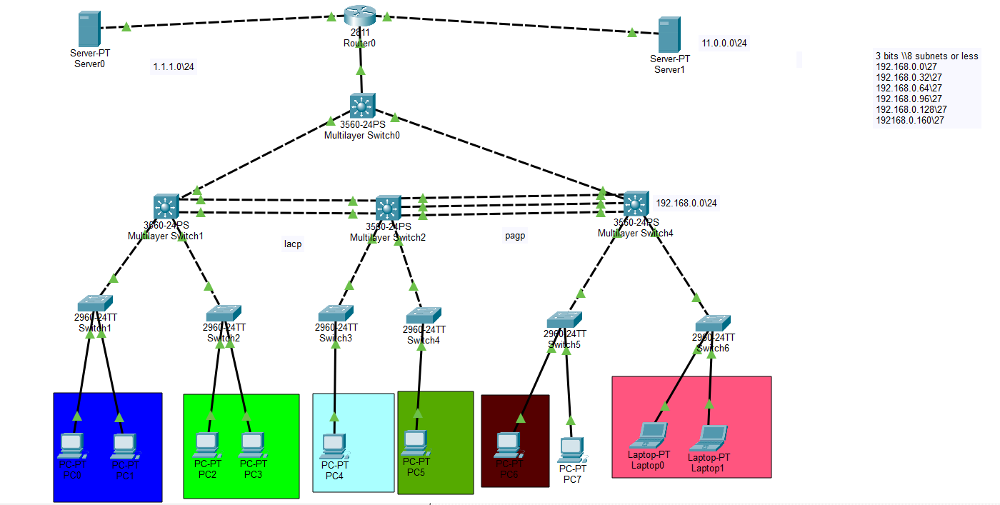

# Cisco Enterprise Networking Lab for Beginners

A hands-on Cisco Packet Tracer lab designed to help beginners practice essential CCNA networking concepts in one complete enterprise topology.

This project combines Layer 2, Layer 3, network security, and switching technologies into a single practical lab that can be used for self-learning and revision.

---

## Network Topology


## Objectives

This lab demonstrates how multiple networking concepts work together in a real enterprise network.

The implemented tasks include:

- Basic device configuration
- DHCP configuration
- VLAN creation
- IP subnetting
- Router-on-a-Stick (Inter-VLAN Routing)
- EtherChannel (LACP & PAgP)
- Spanning Tree Protocol (STP)
- Port Security
- PortFast
- BPDU Guard
- Static Routing
- HTTP Connectivity Testing

---

## Network Design

### Internal Network

- Network Address: **192.168.0.0/24**
- Subnet Mask: **/27**
- Multiple VLANs created using subnetting.

### External Networks

- Google Server: **1.1.1.0/24**
- Internal Server: **11.0.0.0/24**

---

## Technologies Used

- Cisco Packet Tracer
- Cisco Router 2811
- Cisco Catalyst 3560 Multilayer Switch
- Cisco Catalyst 2960 Access Switch
- DHCP
- VLANs
- Trunking (802.1Q)
- Router-on-a-Stick (ROAS)
- EtherChannel
- LACP
- PAgP
- STP
- PortFast
- BPDU Guard
- Port Security
- Static Routing
- HTTP Server

---

## Implemented Tasks

### 1. Basic Configuration

- Hostnames
- Passwords
- Console & VTY configuration
- Banner MOTD
- Interface descriptions

---

### 2. DHCP

- DHCP Pools
- Excluded Addresses
- Default Gateway
- Automatic IP Assignment

---

### 3. VLANs

- VLAN Creation
- Access Port Assignment
- Trunk Configuration

---

### 4. Inter-VLAN Routing

Router-on-a-Stick (ROAS)

- Subinterfaces
- 802.1Q Encapsulation
- Gateway Configuration

---

### 5. EtherChannel

- LACP
- PAgP

---

### 6. STP & Security

- Root Bridge
- PortFast
- BPDU Guard
- Port Security

---

### 7. External Connectivity

- Static Default Route
- HTTP Connectivity to Google Server

---

## Verification

The following commands were used to verify the network:

```bash
show vlan brief

show ip dhcp binding

show etherchannel summary

show spanning-tree

show port-security interface

ping

tracert
```

HTTP connectivity was verified using the Packet Tracer Web Browser.

---

## Project Structure

```text
.
├── LAB.pkt
├── README.md
├── screenshots/
├── configs/
└── docs/
```

---

## Learning Outcomes

After completing this lab, you will gain practical experience with:

- Enterprise network design
- VLAN segmentation
- DHCP deployment
- Layer 2 switching
- Layer 3 routing
- Network security
- EtherChannel configuration
- STP optimization
- Cisco IOS CLI troubleshooting

---

## Future Improvements

- OSPF
- ACLs
- NAT
- SSH
- HSRP
- Syslog
- NTP
- AAA Authentication

---

## Author

**Reem Abdelraof**

GitHub: https://github.com/reem-abdelraouf
